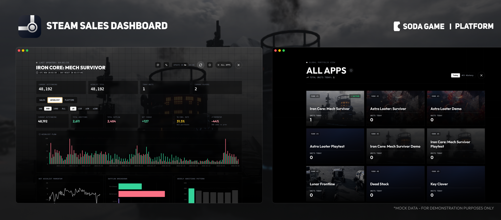
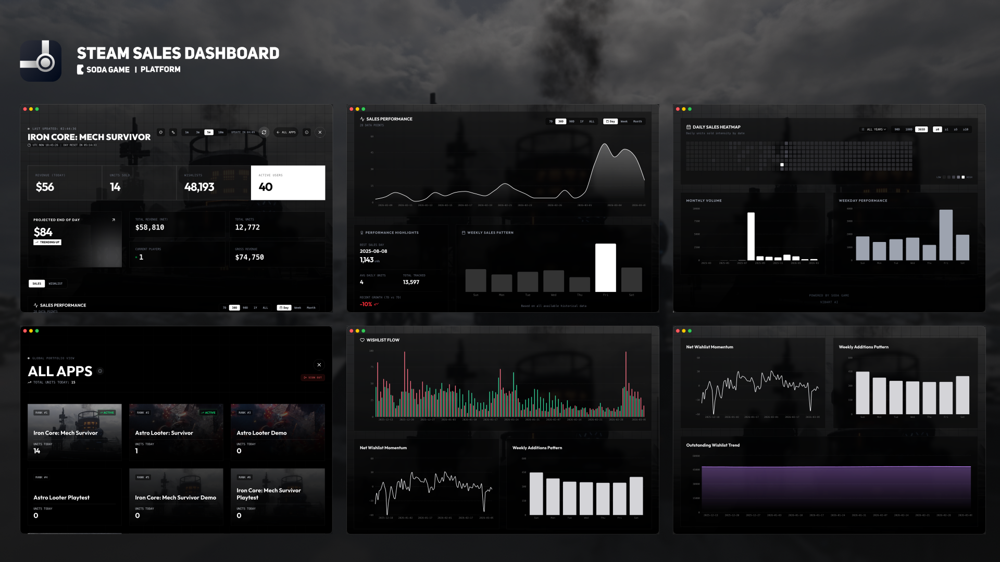

# Steam Sales Dashboard

[English](README.md) | [简体中文](README_zh-CN.md)



为 Steam 应用/游戏开发者打造的现代化实时销量数据可视化仪表盘。

**由 [SODA GAME](https://soda-game.com) 出品**

## ✨ 功能特性

**实时监控**
*   **实时指标**：追踪 *今日收入*、*今日销量*、*愿望单总量* 和 *活跃用户*。
*   **算法预测**：基于当前销售速度，自动预测今日最终销量。
*   **UTC 时钟**：随时掌握 Steam 官方结算时间 (UTC 00:00)。

**深度数据分析**
*   **销售表现**：交互式收入与销量图表。支持筛选 *7天*、*30天*、*90天*、*1年*、*全部* 或 *自定义日期范围*。
*   **高级洞察**：
    *   **热力图**：可视化全年销售强度分布。
    *   **周规律**：识别游戏在一周内表现最好的日子。
    *   **月度销量**：追踪长期季节性趋势。

**愿望单分析**
*   **愿望单流向**：可视化每日新增与移除/购买的对比。
*   **净动量**：追踪愿望单的净增长率。
*   **转化追踪**：监控待实现愿望单库存及转化事件。

**全局管理**
*   **多应用支持**：专为拥有多款游戏的发行商或开发者设计。
*   **全局概览**：在一个统一视图中查看所有游戏按日表现的排名。

## 📖 用户手册与操作指南

### 1. 安装

**支持平台**
*   **Windows**: 完全支持。
*   **macOS**: 完全支持。
*   **Linux**: 理论上支持（需自行编译，未提供官方构建）。

**下载**
从 [Releases 页面](https://github.com/the-super-engine/steam-sales-dashboard/releases) 获取最新版本。

**macOS 用户**
若启动时被系统拦截，请在终端执行以下命令：
```bash
xattr -cr /Applications/"Steam Sales Dashboard.app"
```

---

### 2. 首次启动与登录

当您首次打开应用时：
1.  您将看到官方的 **Steamworks 登录** 页面。
2.  请使用您的 Steam 合作伙伴凭证登录。
    *   **安全提示**：鉴权信息仅限保存在这个应用程序的本地，本应用只提供一个浏览器能力，不会上传到任何云端或第三方中转服务。您是直接登录到 Valve 的官方网站。本应用使用标准浏览器窗口加载页面，**不会**记录、存储或传输您的密码。
3.  完成必要的 2FA (Steam 令牌) 验证。

---

### 3. 使用仪表盘

登录成功后，应用会自动检测您的会话并切换到 **仪表盘视图**。



**全局概览 (Portfolio View - 适用于发行商/多应用开发者)**
*   如果您的账户管理多个游戏，您将看到 **全局概览 (Portfolio Dashboard)**。
*   此屏幕显示所有应用的摘要，按排名和销量排序。
*   **操作**：点击任意游戏卡片查看其详细表现。

**游戏仪表盘 (Game Dashboard - 单应用视图)**
*   **实时统计**：一目了然地查看 "今日收入"、"销量"、"愿望单" 和 "活跃用户"。
*   **历史数据**：应用会自动从 Steamworks 下载并解析您的销量和愿望单 CSV 文件，生成交互式图表。
*   **预测**：根据当前趋势，通过算法预测今日最终销量。

---

### 4. 更新与刷新

*   **自动刷新**：仪表盘每 **5 分钟** 自动更新一次数据。
*   **手动刷新**：点击顶部工具栏的 "刷新" 图标强制立即更新。
*   **应用更新**：应用会在启动时检查新版本。如果有可用更新，您将看到带有下载链接的通知。

---

### 5. 退出登录

如果您需要切换账户：
1.  前往 **全局概览** 页面（如果您在游戏视图中，请点击 "返回"）。
2.  点击右上角的 **退出登录 (Sign Out)** 按钮。
3.  您将返回到 Steamworks 登录页面。

---

## 🔒 隐私与安全原则

本应用设计遵循 "本地优先 (Local-First)" 理念，确保您的数据隐私安全。

**技术原理**
*   **辅助浏览 (Assistive Browsing)**：本应用本质上是一个运行在本地环境的专用浏览器。它加载 Steamworks 官方网站，并在标准界面之上提供了一个现代化的可视化层作为替代视角。
*   **非侵入式**：我们不注入代码到 Steam 服务器，也不修改底层的 Steamworks 平台。应用仅仅是读取您当前浏览器会话中已经显示的数据来生成仪表盘。
*   **无需 API 密钥**：我们不使用 Steam Web API，因此不需要您提供 API Key 或特殊权限。
*   **零数据收集**：我们不会上传、汇总或中转任何数据到第三方数据库。所有处理都在您的本地环境中进行。

**重要说明**
由于本应用依赖于 Steamworks 网页的结构：
*   如果 Valve 更新了 Steamworks 的数据结构或页面方式，本应用可能会暂时失效。
*   此时建议您等待我们的更新，或者因为本项目是开源的，您可以 Fork 代码并自行修复选择器。

1.  **直连**：本应用作为一个专用网页浏览器运行。它 **仅** 与 `partner.steampowered.com` 通信。
2.  **无云端存储**：您的销量数据、收入数字和玩家计数 **100% 本地** 在您的计算机内存和磁盘上处理。没有任何内容上传到我们的服务器或任何第三方云端。
    *   **再次强调**：用户的鉴权信息仅限本地保存在这个应用程序的本地，本应用只提供一个浏览器能力，不会上传到任何云端或第三方中转服务。
3.  **开源**：完整源代码可供审计。如果您不希望使用预编译的二进制文件，可以自行构建。

---

## 开发

### 前置要求
- Node.js (v20 或更高版本)
- npm

### 设置
```bash
git clone https://github.com/the-super-engine/steam-sales-dashboard.git
npm install
npm run dev
```

### 构建
```bash
npm run build
```

## 技术栈
- **Electron**: 跨平台桌面框架
- **React**: UI 库
- **Vite**: 构建工具
- **Tailwind CSS**: 样式
- **Recharts**: 数据可视化

## 许可证
MIT

## 致谢
Powered by [Soda Game](https://soda-game.com) & [Vibart AI](https://vibart.ai)
